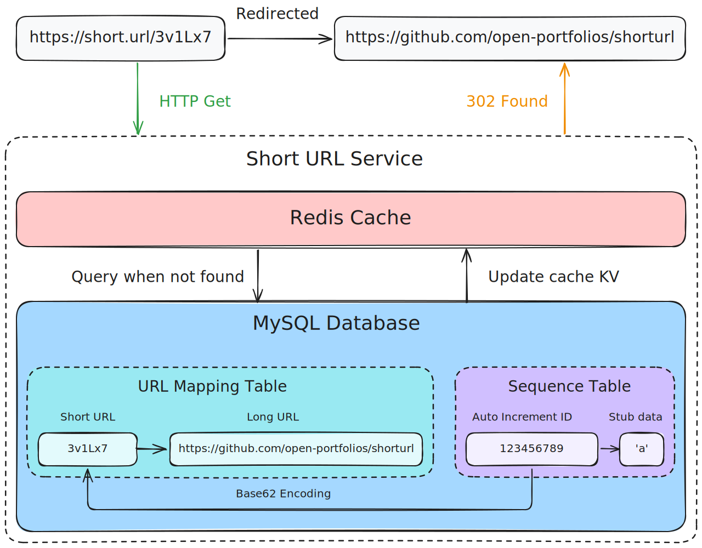
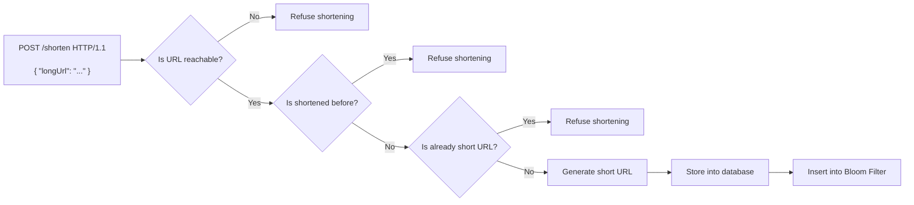
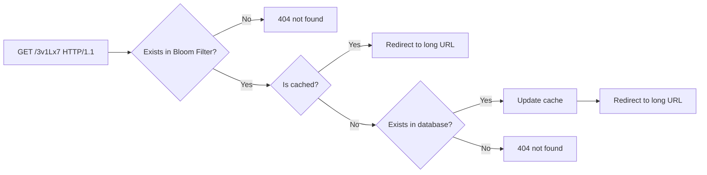

# Short URL
A Go short URL service.

## Prerequisites

### Container Engine
This project uses [Podman](https://podman.io) as the container engine, but any OCI-compatible container engine should work.

[Docker](https://www.docker.com) support is included.

### Taskfile

[Taskfile](https://taskfile.dev) is introduced as an alternative to Makefile. Instead of typing a cluster of long long commands, you can use 

- `task up` to compose up containers
- `task migrate` to create tables, insert values from the SQL files under [sql/](./sql)
- `task run` to run server
- `task database` to connect to the interactive shell of the database in the container
- `task cache` to connect to the interactive shell of the cache in the container
- `task down` to shut down containers
- `task clean` to shut down containers and **remove all data** (be careful!)

Taskfile uses the YAML format, and you will find it familiar if you have read GitHub Actions workflows before.

### Go
*The language we Gophers love*. The [Go](https://go.dev) version of this project is 1.26.2.

> [!NOTE]
>
> This project adopts the [go-zero](https://go-zero.dev) framework. To generate code from API files (`*.api`), please follow the [official guide](https://go-zero.dev/getting-started/). You don't need to install go-zero toolchain if you're not developing new features.

## Quick Start

To run the short url server, just follow the three steps:

1. **Compose up containers**. Middlewares used in this project are defined in [docker-compose.yml](./docker-compose.yml). If you're using Podman or Docker, you can just run `task up` to do so.
2. **Migrate database**. Create database and tables defined in the [sql/](./sql) directory. `task migrate` is the shortcut.
3. **Start the server**. Run the server entrypoint under [cmd/server](./cmd/server). `task run` is the shortcut.

## Core Logic

### Shorten URL

### Redirect

